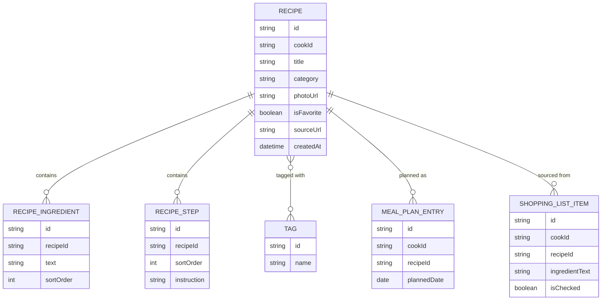

# Domain Model

A Cook owns a private collection of Recipes, each tagged and categorized, each
built from Ingredients and Steps. Recipes get planned onto a weekly Meal Plan,
which generates Shopping List items the Cook checks off while shopping.

- **RECIPE** is the core entity; `cookId` scopes every row to its owner, taken
from the signed-in caller, never from the request body. `sourceUrl` is set
when the recipe was created via the import agent.
- **RECIPE\_INGREDIENT** and **RECIPE\_STEP** are ordered child lists of a
recipe; `text` on an ingredient carries quantity, unit and name together as
a free-form line (e.g. "2 cups flour").
- **TAG** is shared vocabulary per Cook; a recipe may carry several.
- **MEAL\_PLAN\_ENTRY** assigns a recipe to a date on the Cook's weekly plan.
- **SHOPPING\_LIST\_ITEM** is generated from the recipes in the meal plan, one
row per recipe ingredient (listed separately per recipe, never merged), and
tracks whether the Cook has checked it off.

