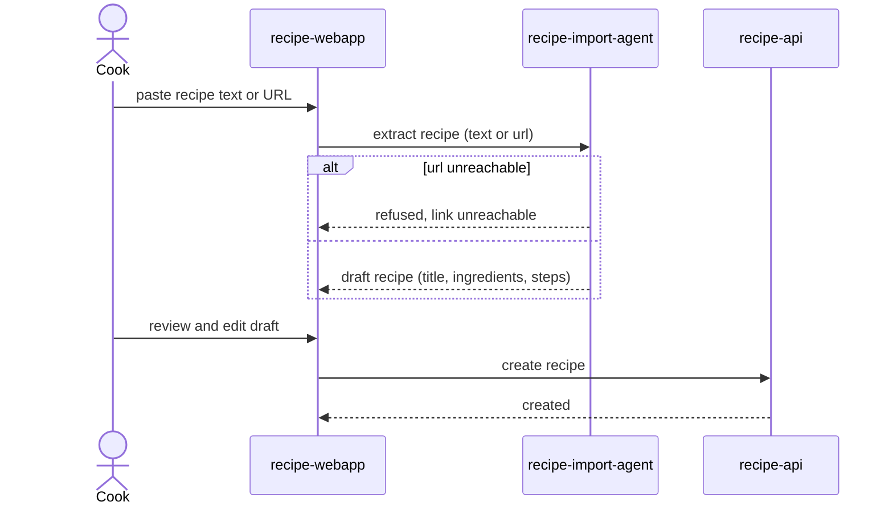

# Import a recipe with the agent

A Cook hands the app pasted recipe text or a URL; the import agent extracts a
structured recipe, which the Cook reviews and corrects before it is saved.

```mermaid
sequenceDiagram
    actor Cook
    participant recipe-webapp
    participant recipe-import-agent
    participant recipe-api

    Cook->>recipe-webapp: paste recipe text or URL
    recipe-webapp->>recipe-import-agent: extract recipe (text or url)
    alt url unreachable
        recipe-import-agent-->>recipe-webapp: refused, link unreachable
    else
        recipe-import-agent-->>recipe-webapp: draft recipe (title, ingredients, steps)
    end
    Cook->>recipe-webapp: review and edit draft
    recipe-webapp->>recipe-api: create recipe
    recipe-api-->>recipe-webapp: created
```

