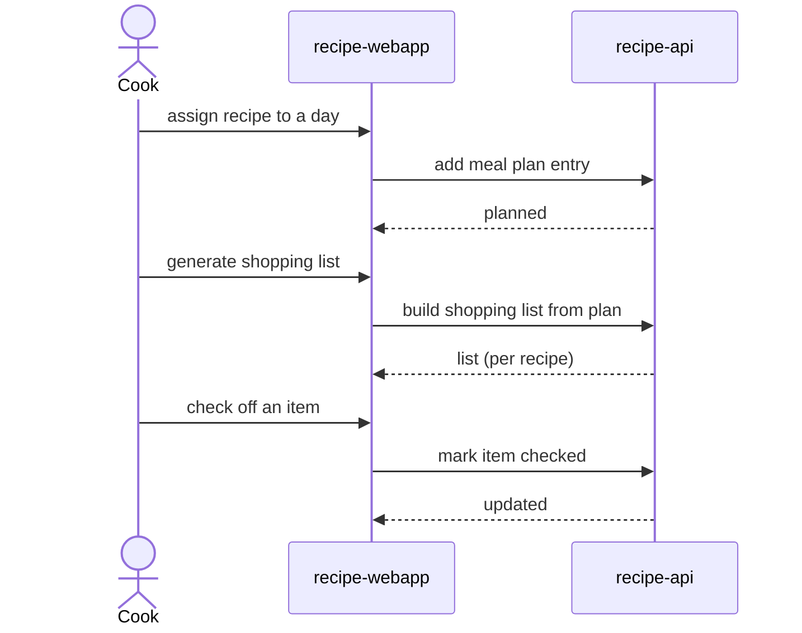

# Plan meals and shop

A Cook assigns recipes to days of the week, generates a shopping list from
that plan, and checks items off while shopping.

```mermaid
sequenceDiagram
    actor Cook
    participant recipe-webapp
    participant recipe-api

    Cook->>recipe-webapp: assign recipe to a day
    recipe-webapp->>recipe-api: add meal plan entry
    recipe-api-->>recipe-webapp: planned
    Cook->>recipe-webapp: generate shopping list
    recipe-webapp->>recipe-api: build shopping list from plan
    recipe-api-->>recipe-webapp: list (per recipe)
    Cook->>recipe-webapp: check off an item
    recipe-webapp->>recipe-api: mark item checked
    recipe-api-->>recipe-webapp: updated
```

